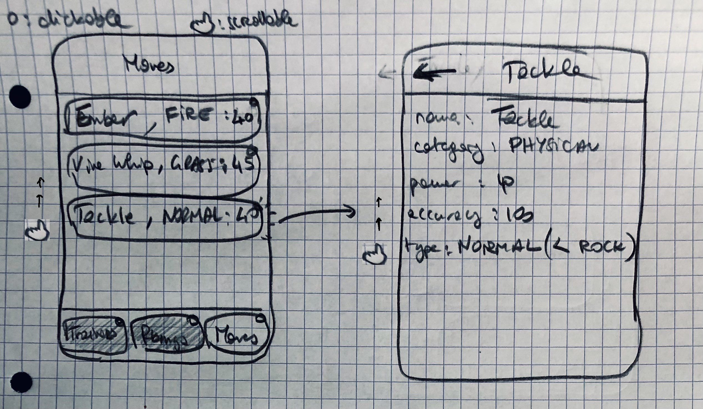

# AD_ReactNative

A React Native app for educational purposes. Refer
to [instructions here](https://react-native-courses.clubinfo-clermont.fr/docs/notation).

+ [Notation checklist](#notation-checklist)
+ [Sketches](#sketches)
    - [Pokemongs](#pokemongs)
    - [Moves](#moves)
+ [Using the app](#using-the-app)

## Notation checklist

* [ ] Documentation (6 pts)
  - [ ] Application sketches (4 pts)
  - [ ] A Readme describing your project/application. (2 pts)
* [x] Basics (20 pts)
  - [x] Navigation (3 pts)
    + [x] Tab bottom navigation (2 pts) AND at least one button (1 pts)
  - [x] Redux Store (10 pts)
    + [x] Read data from redux store (2 pts)
    + [x] Update data to redux store with actions and reducers (slice = 0) (4 pts)
    + [x] Update data to redux store using redux-thunk (API AND|OR AsyncStorage) (4 pts)
  - [x] Display list of items (2 pts)
    + [x] FlatList, VirtualizedList or SectionList
  - [ ] ~~Display dynamic image (2 pts)~~
  - [x] Binding child component props (1 pts)
  - [x] Handle a TextInput correctly (2 pts)
    + [x] Beware of keyboard management
* [ ] Application features (14 pts)
  - [x] Retrieve data using the Web API (6 pts)
    + [x] Handle fetch success callback (3 pts)
    + [x] Handle fetch error callback (3 pts)
  - [ ] Store favorite data into phone storage (2 pts)
  - [ ] Write Tests (6 pts)
    + [ ] all actions payload (1 pts)
    + [ ] all reducers case (2 pts)
    + [x] one UI Component (3 pts)

## Sketches

This app will contain several "master/detail" tabs. They are as follows.

### Moves

## Using the app

This app is linked to a backend that is set up to accept CORS from [`http://localhost:19006`](http://localhost:19006).
If you want to use the dedicated API, please make sure you're not overriding that default port number when running this
app.
