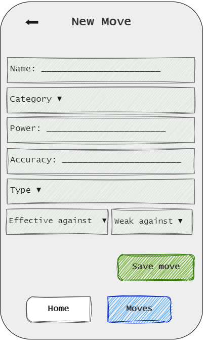

# PoKeMoNg

A React Native app for educational purposes. Refer
to [instructions here](https://react-native-courses.clubinfo-clermont.fr/docs/notation).

- [About](#about)
- [Notation checklist](#notation-checklist)
- [Sketches](#sketches)
    - [Home](#home)
    - [Collection](#collection)
    - [Detail](#detail)
    - [Creating](#creating)
    - [Updating](#updating)
- [Some business logic](#some-business-logic)
- [Using the app](#using-the-app)
    - [Running the backend](#running-the-backend)
    - [Connecting to the backend locally](#connecting-to-the-backend-locally)
    - [Running this app](#running-this-app)
- [Testing the app](#testing-the-app)
- [Known limitations](#known-limitations)
    - [Sparse](#sparse)
    - [Hardcoded enums](#hardcoded-enums)

## About

PoKeMoNg is a React Native application developed for educational purposes. The application is designed to showcase
a "master/detail" view of `Moves`, with basic CRUD features. The application is linked to
a [backend API](https://github.com/draialexis/pokemong_api) that provides the data for the Moves.

## Notation checklist

* [x] Documentation (6 pts)
    - [x] Application sketches (4 pts)
    - [x] A Readme describing your project/application. (2 pts)
* [x] Basics (20 pts (- 2))
    - [x] Navigation (3 pts)
        + [x] Tab bottom navigation (2 pts) AND at least one button (1 pts)
    - [x] Redux Store (10 pts)
        + [x] Read data from redux store (2 pts)
        + [x] Update data to redux store with actions and reducers (slice = 0) (4 pts)
        + [x] Update data to redux store using redux-thunk (API AND|OR AsyncStorage) (4 pts)
    - [x] Display list of items (2 pts)
        + [x] FlatList, VirtualizedList or SectionList
    - [ ] ~~Display dynamic image (2 pts)~~
    - [x] Binding child component props (1 pts)
    - [x] Handle a TextInput correctly (2 pts)
        + [x] Beware of keyboard management
* [x] Application features (14 pts (- 2))
    - [x] Retrieve data using the Web API (6 pts)
        + [x] Handle fetch success callback (3 pts)
        + [x] Handle fetch error callback (3 pts)
    - [ ] ~~Store favorite data into phone storage (2 pts)~~
    - [x] Write Tests (6 pts (- 1))
        + [ ] ~~all actions payload (1 pts)~~
        + [x] all reducers case (2 pts)
        + [x] one UI Component (3 pts)

## Sketches

This app will contain a home page, and a "master/detail" tab for `Moves` with basic CRUD features.

### Home

The home screen provides a logo, and tab navigation options to other parts of the application.


### Collection

The collection screen displays a list of `Moves` fetched from the API.

>

### Detail

The detail screen displays detailed information about a selected `Move`.

>

### Creating

The creating screen provides a form for creating a new `Move`.

>

### Updating

The updating screen provides a form for updating an existing `Move`.

>

## Some business logic

While the back end doesn't forbid a `Move` from being both weak against and effective against the same one type,
it should. That's one of the flaws of that API.

In this app, we did implement the business logic described above in our callbacks for our `MultiSelect` elements, like
so:

```typescript
const handleSelectType = (selectedTypes: string[], setTypes: React.Dispatch<React.SetStateAction<string[]>>, otherSelectedTypes: string[]) => {
    const uniqueSelectedTypes = Array.from(new Set(selectedTypes));
    const withoutDuplicatesFromOtherColumn = uniqueSelectedTypes.filter(type => !otherSelectedTypes.includes(type));
    setTypes(withoutDuplicatesFromOtherColumn);
};
```

## Using the app

### Running the backend

In order to use this app, you will need to run the dedicated backend. A `README`
with [instructions](https://github.com/draialexis/pokemong_api#user-content-prep-steps) is provided
for that purpose.

### Connecting to the backend locally

First, please find the `config.ts` file at the root of this project, and replace ~~`192.168.0.15`~~
with the IPv4 address associated with your own Wi-Fi adapter.

To find that address out, you can run `ipconfig` on Windows or `ifconfig` on macOS/Linux in your terminal.

### Running this app

Then, with the [Expo CLI](https://docs.expo.dev/more/expo-cli/) installed, at the root of the project, simply run

```bash
npx expo start
```

or

```bash
yarn start
```

The app should launch successfully, and instructions should be provided in terminal to open it on a number of devices.

## Testing the app

You can run some partial automated tests on `moveReducer.ts`, on `TypeTacticsInfoList.tsx`, and
on `MoveDetailScreen.tsx`
by running the command

```bash
yarn run test
```

## Known limitations

Beside whatever items may not have been checked off the [notation checklist](#notation-checklist), there are also
a number of known limitations and issues with this app.

### Sparse

See #4, #5, #9

Even though the API provides [a variety of entities](https://github.com/draialexis/pokemong_api#about)
with fun business logic, this app only implemented a "master/detail" and the basic CRUD features on one entity: `Move`.

In short, for lack of time, this app doesn't quite manage to do anything beyond the basic requirements. It doesn't
use the API to its full potential, and the API doesn't really get a legitimate reason to provide even more interesting
routes (for instance, aggregation pipelines and filtered searches).

### Hardcoded enums

See #12

Enums of values such as `TypeName` and `MoveCategoryName` are defined by the API. The API provides an OAS, so we could
get those enums dynamically instead of copying and pasting them in this front-end project.

Of course, that may increase complexity beyond the scope of this project, and it may impact performance negatively --
but it seems like something we would take care of before deploying this app to production, in real-world conditions.
